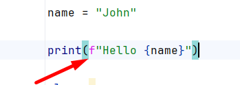
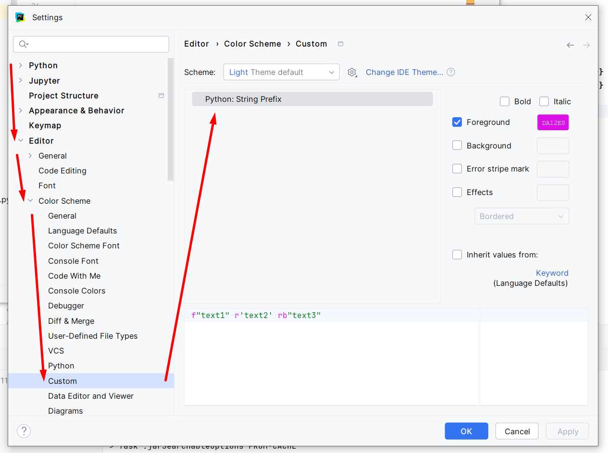

# Python String Prefix Color

<!-- Plugin description -->
**Python String Prefix Color** is a PyCharm plugin that adds the functionality to colorize Python string prefixes.

To customize the Python string prefix color, go to Settings -> Editor -> Color Scheme -> Custom -> Python: String Prefix.
<!-- Plugin description end -->

## Screenshot

### Annotator:

### Color settings page:

## Features

- Customizing the color for Python string prefixes.
- Supports all Python string prefixes and their combinations, both lowercased and uppercased.
- Supports both PyCharm Community and Professional.

## Requirements

- PyCharm 2025.2 (build 252) or later.

## Installation

Get it from https://plugins.jetbrains.com/plugin/29002-python-string-prefix-color.

Or from Settings -> Plugins -> Marketplace (search for Python String Prefix Color).

After installing the plugin click on **Apply**.

The color settings page now appears in Settings -> Editor -> Color Scheme -> Custom.
